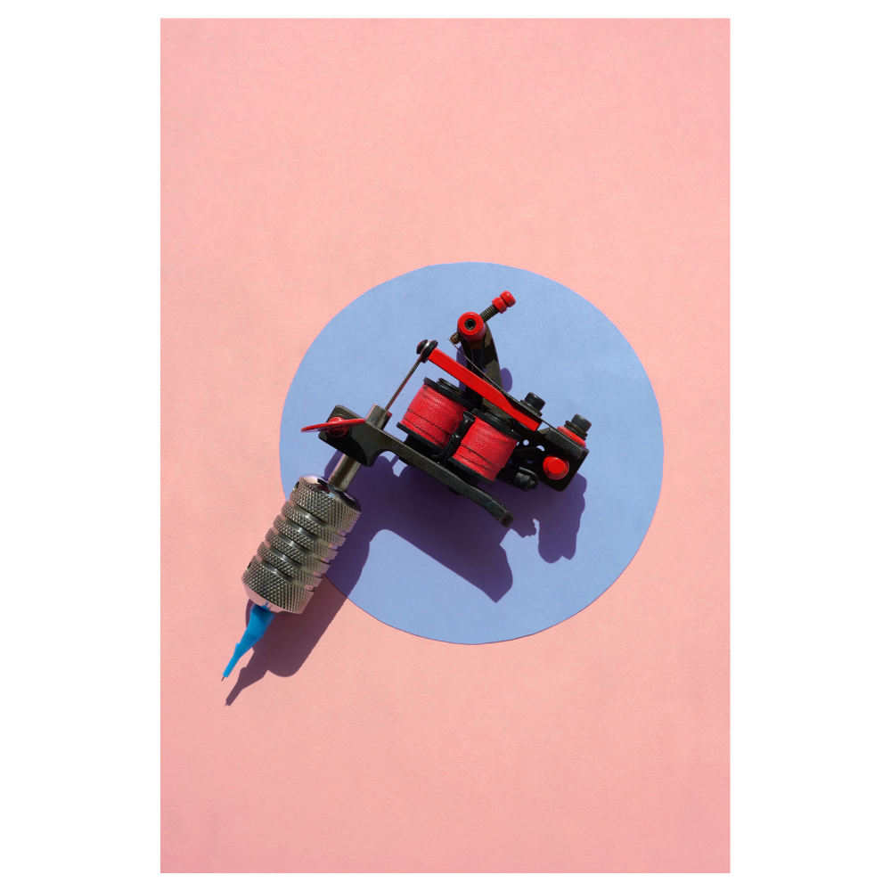
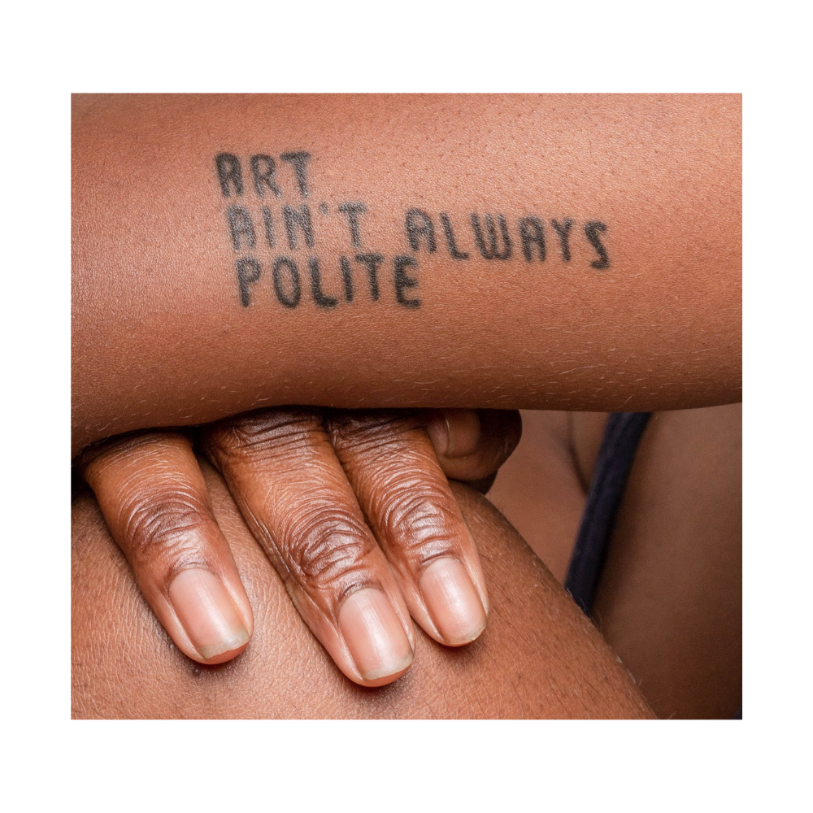

Tattoos are becoming a larger and larger part of our culture and the allure of permanent art is strong but why do some tattoos have a greater impact than others?

People use tattoos as a form of expression and art to communicate the way they are feeling or simply use their bodies as a blank canvas. For many the idea of permanently inking their skin is still viewed as taboo but the rest of the community tend to value the art more highly than a Monet or Van Gogh due to the personalisation of the project.

The different typefaces used in each tattoo make them extremely individual to the person it is inked on. And these can change the meaning of any art to something completely different. For instance, the use of a Blackletter typeface would create a more gothic style, perhaps connected to biblical references or in use of text with skulls and roses. Equally this may simply be an indicator of an artist’s unique tattooing style.

Similarly, the use of a monospace typeface such as “Roboto Mono” would mimic the style of a typewriter and therefore may be used in art works where the individual wants lots of clarity of the text.

However, some tattoos have a more powerful message behind them, and we can see the typography reflect this. Where a text may be written in all uppercase or in bold. This is seen in the image below.

These kinds of art tend to use more rigid typefaces to ensure that the message has strong connotations and perhaps authoritative tones. Further the amount of whitespace is very important in contributing to the power of the tattoo as more whitespace would relate to more clarity. In causes or important messages, the meaning should always be clear and therefore reinforced in the whole design of a piece.

Tattoos are so widely viewed as meaningful or meaningless and the context of the art contributes highly to this spectrum. For instance, a tattoo in memory of a loved one is likely to be more powerful than a random text with no meaning behind it such as “chicken”. The typefaces are then impacted by stylistic choices such as bold or italic fonts which further change the meaning. But without pre-existing concepts of what different typefaces or fonts associate with, all tattoos would be lost in each other.