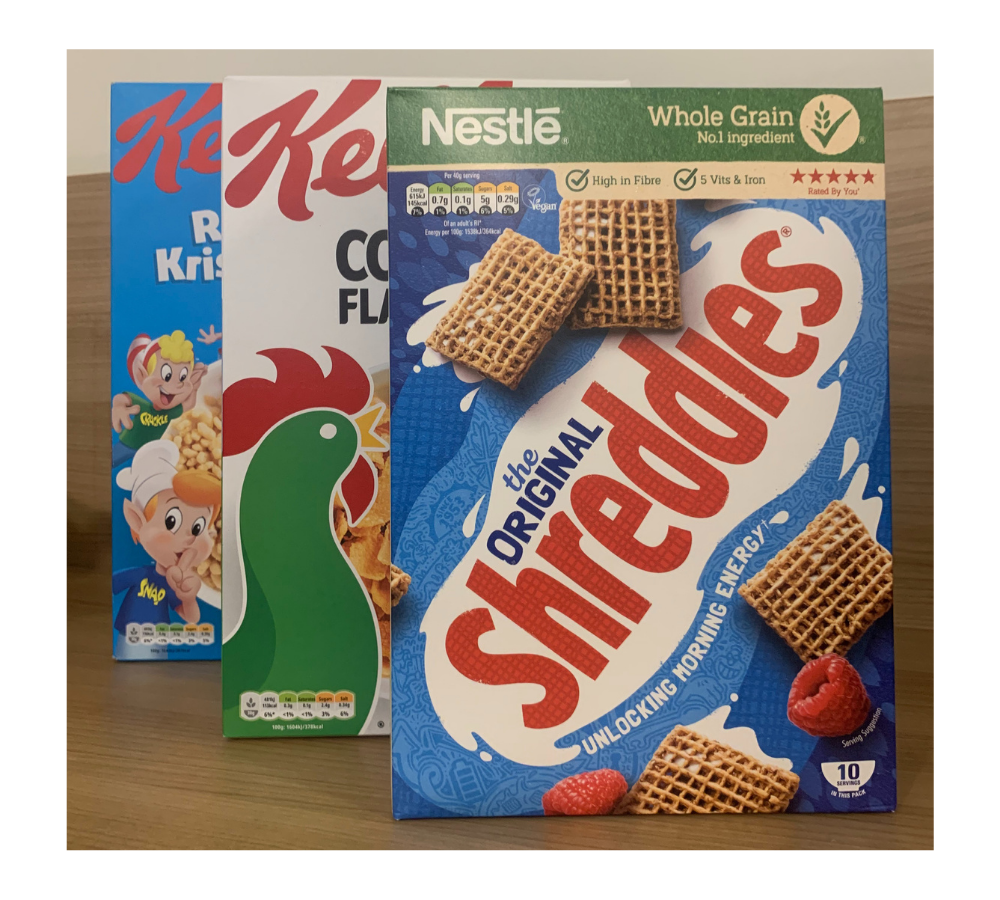

## Red Letters on The Box.

Breakfast is the most important meal of the day. And for many this means something quick before work, with most turning to trusted cereal brands to save the day.

The food industry is a thriving and continuously growing place with areas of the market overly saturated and constant introduction of new products, which begs the question, how do brands stand out in such a large crowd?

Breakfast and cereal companies are one of the most populated markets going, and so their marketing campaigns and initial branding have to be powerful enough to overshine its competitors.

Kellogg’s uses typography as just one of its tools to succeed. With large letters and bright colours, the Kellogg’s brand is the most trusted and easily identified brand within the market.

Kellogg’s uses a custom typeface for its logo, crafted in a script style mimicking handwriting, this is often seen in advertising of products aimed at children, like various cereal brands, because of the playful and fun connotations the font brings. These themes are continued throughout the packaging with the addition of spokescharacters such as ‘Tony the Tiger’ and ‘Snap! Crackle! Pop!’, which personalised a once cold and unexciting product.

This is only furthered by the choice in red to colour the text, the saturation is quite high creating a vibrant logo which is appealing and draws your eye straight to a well-known brand name we all love. Kellogg’s have strategically chosen this colour to stand out in a sea of cereal boxes in the supermarket aisles. The colour has connotations of both being alarmed and enjoyment which work hand in hand for a positive experience of all the products.

The product name itself on each cereal box tends to use sans serif or slab serif typefaces in various colours including black and white, ‘Rice Krispies’, ‘Corn Flakes’. These associate the brand and individual cereal to strength; a clever way to reinforce the idea that eating their product will make you strong and healthy.

This approach can also be seen among competitor brands such as Nestle with the Original Shreddies where they use strong lettering to reiterate why their product is better than another brand along the aisle, and how it delivers on its promises.

Our brains read typography and see more than just red letters on a box and trick us into thinking this product is the best based on its branding. The result is a bowl of Kellogg’s in the morning so few are complaining.