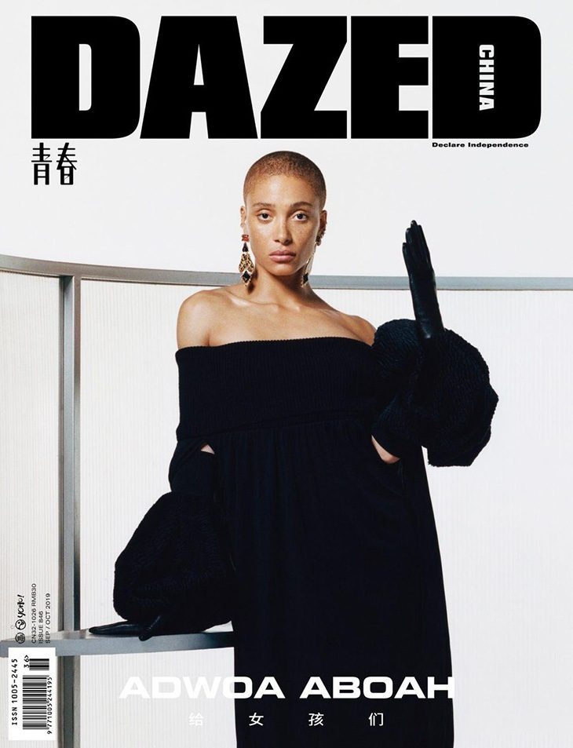

## Like the song. 

Vogue uses a didone font throughout its content. This font is similar to the more famous typeface – Didot. Didone is used across the brand and there are no other typefaces that appear. Vogue’s title is written in uppercase lettering to reinforce the authority of the brand within the fashion and beauty industry. And its content then speaks for itself in proving this. 

Vogue’s colour choices express this with a simplistic black and white palette. All the attention is on the content that they produce, highlighting its value. These properties present the brand as clean and minimal which is a goal many consumers relate to or in terms of minimal some of us aspire to be.  

Vogue uses a logo which consists of just the brand name this creates its own impact and plays a large role in their visual identity, highlighting its dominance. This is consistent across all the imagery on the site. The brand uses typography to create powerful and inspiring content. 

The composition of the letters the brand use is elegant with quaint serifs on each character, there is also a sense of sophistication in this. The weight and width of the characters reinforces this, with light almost extended letters which stand effortlessly. The total amount of whitespace is fairly large in between the letters this is a tactful decision by the brand to create thought-provoking austerity. 

## But not blurry.

Dazed takes the opposite approach and creates a beautiful but bold profile for its brand. The weight of the typeface is heavy and stern, there is nowhere to hide in this title, it is strong and established, it has rigid blocked letters to create this feeling. You cannot help but respect it when you look at it. 

It is a sans serif typeface which is dramatic and unique in its field, which is why it succeeds. In 2020 people like new and different but this structure is safe in a place that is holding on to everything it can.