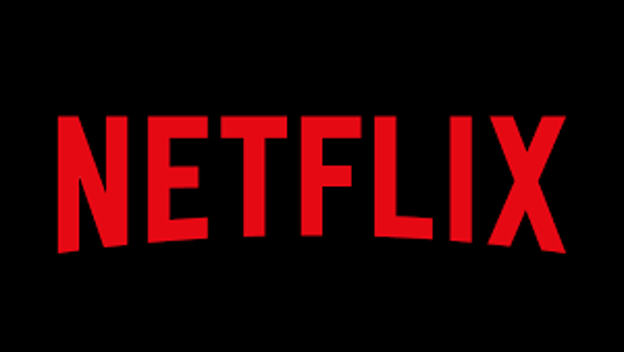

## Watch Me Watch You.

More and more we all spend our time watching watching television and our favourite shows on streaming platforms. but have we every paid attention to the service we’re using?

Many of the facilities offer a deal too good to pass up in terms of value, meaning that books have even more competition for our leisure time. However, ensuring the brand itself is more recognisable and trustworthy means that it is more likely to succeed separate from its service.

There are a series of trends that can be applied generally to most of the streaming brands.

Amazon’s Prime Video can be used as an example. Whereby we see that a sans serif font has been utilised to ensure that all the characters are very clear and legible. Further, the characters have a regular or potentially extended width which combined with the amount of whitespace makes the brand seem very relaxed and composed.   

Additionally, in this example there have been two colours applied, one for each word of the name. the choice of blue reinforces the calm theme and also aligns with the brands goals for the service – they want their consumers to feel comfortable when using the platform. Then the use of black highlights the provides a sense of stability and structure, presenting Amazon as a trustworthy place to invest your money.   

Another example of a popular streaming service is Netflix who also show a sense of structure and strength, however, they use an alternate approach, applying a very rigid typeface to their brand name. Netflix further this by having all the characters in written in uppercase.

In terms of colour, they use black and red, which may convey a sense of alarm, although here they are used to create an escapism for the viewers of the platform. This largely identifies with the brand values of curiosity and inclusion. 

Overall, most streaming brands opt for typographic features that show the companies as strong and long-staying businesses whilst appealing to people through the aesthetic of the logo such as colour choice and voice variables.