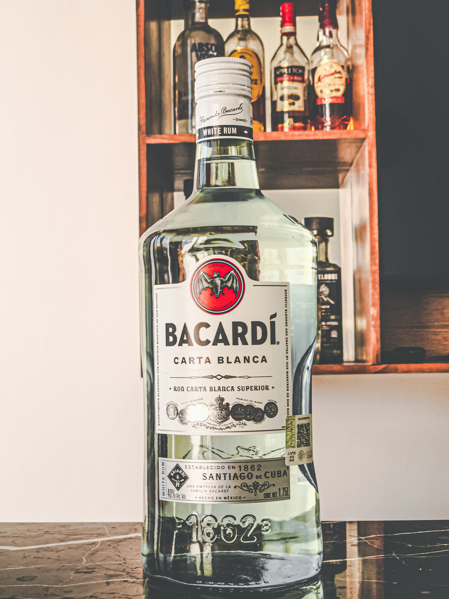

## What makes us drink that booze brand?

After taking a look at the packaging of some cult favourite alcohol brands there are some key features that come to mind. 

Jack Daniel’s uses three different fonts within its packaging, similar to Jasper, Lynchburg Script and Motlow. 

The first of these applies to ‘JACK DANIEL’S’, showing a condensed typeface which reinforces the idea that the brand is trustworthy and established in its field. Similarly, the typeface applied to ‘Tennessee’ shows more sophisticated characteristics in a script font, that appears upright and dignified. Finally, the serif lettering used in the word ‘WHISKEY’ is robust and shows the strong structure of the brand. 

In another example we can see that Bacardi uses a very similar font to Perpetua Titling Roman in their logo, this is a serif font which was designed by Eric Gill who also created the very famous font ‘Gill Sans’. The typography used here is both familiar and unique often seen in vodka brands. This expresses a clean and bold appearance around the product and company behind it. However, in terms of selling itself in the supermarket, the logo stands out among a forest of palm trees and small colourful umbrellas that sit in the top of our glasses. This is simple yet effective branding just by being in control of the typographic design. 

Lastly, we can see that this brand of tequila opts to use a more gothic style typeface for its brand name. This then transitions into a Sans serif font written in uppercase, perhaps reiterating the strong kick it’ll give you after a few sips but also to demonstrate the age of the product, it is telling us something about how long they have been around and will be, a respectable and trustworthy nod to itself.

 The simplicity of the first ever tequila to be sold in a glass bottle offers a premium feel at a bargain price, and we all love cheap spirits.