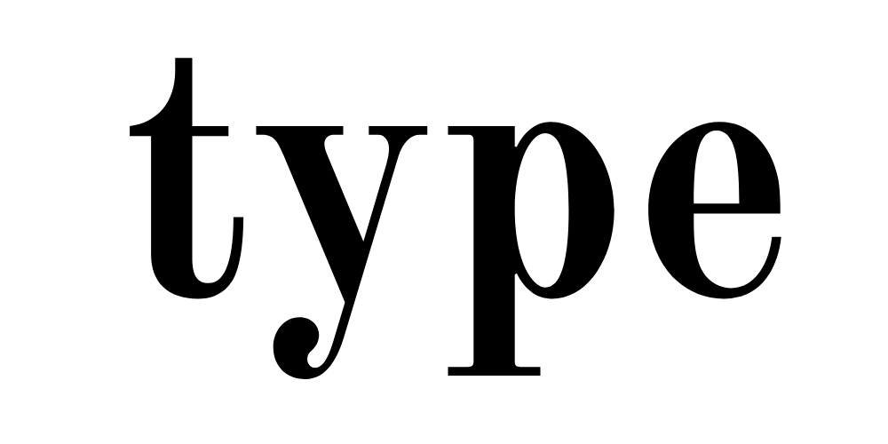
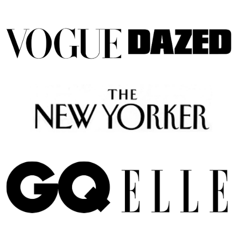

This blog takes a look at the typography used in everyday life and culture, bringing in suggestions of how it is so effective. From examining the packaging on our breakfast cereals to the writing we ink on our skin, this blog hopes to give a more personal insight into the typefaces we see everywhere, that make up our lives. 

My Logo 

For the design of my logo I drew inspiration from the following media brands. 

I chose the font Old Standard