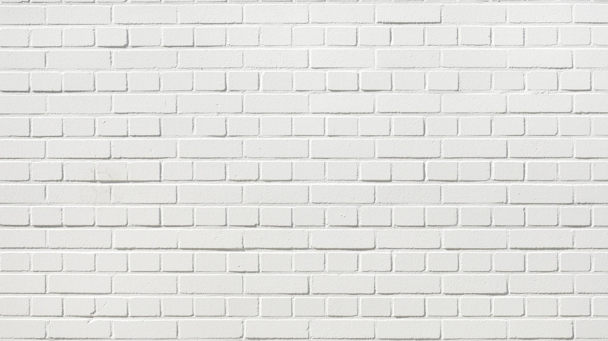
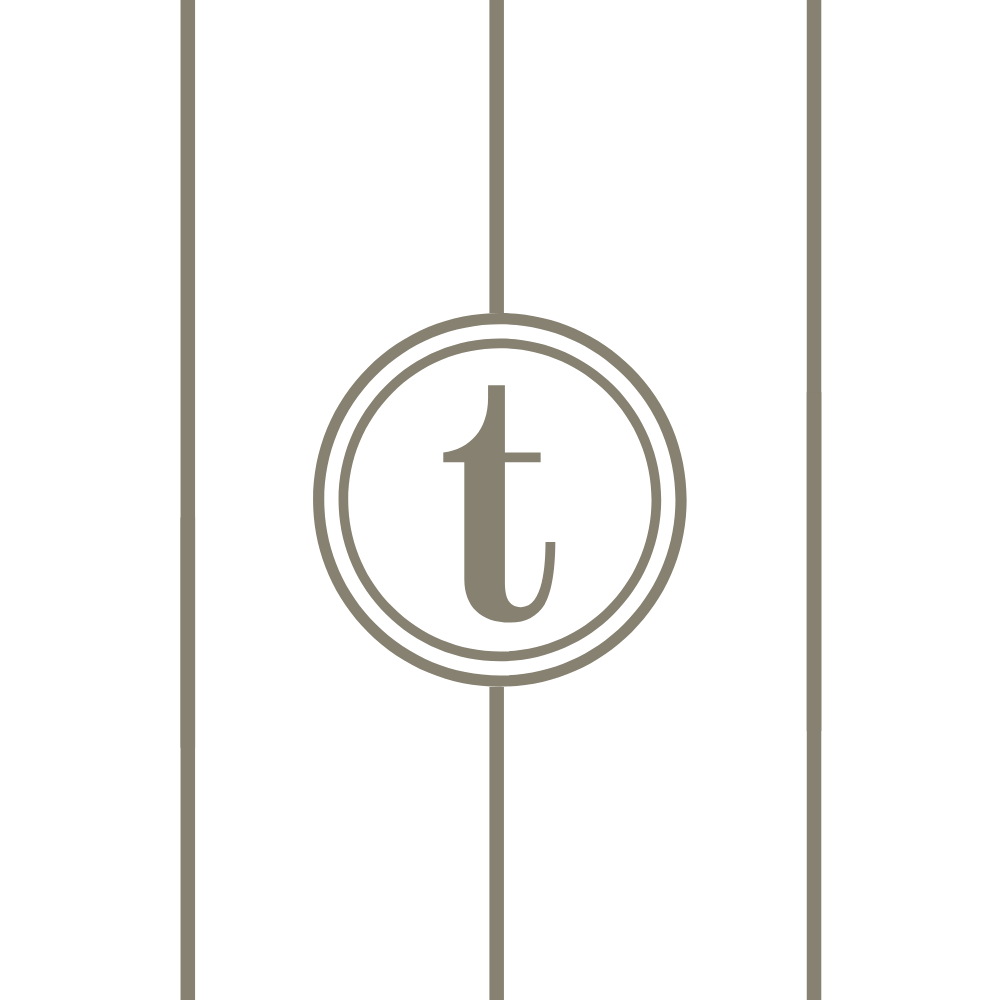
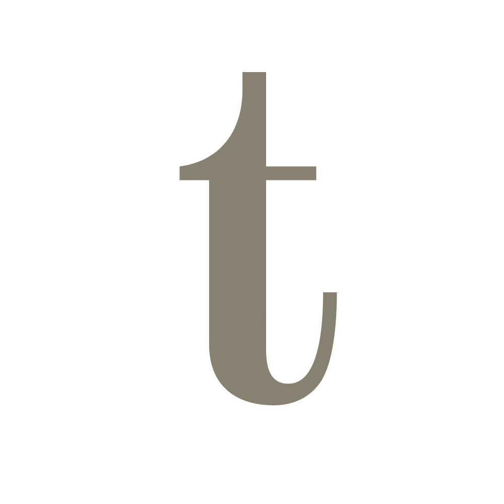
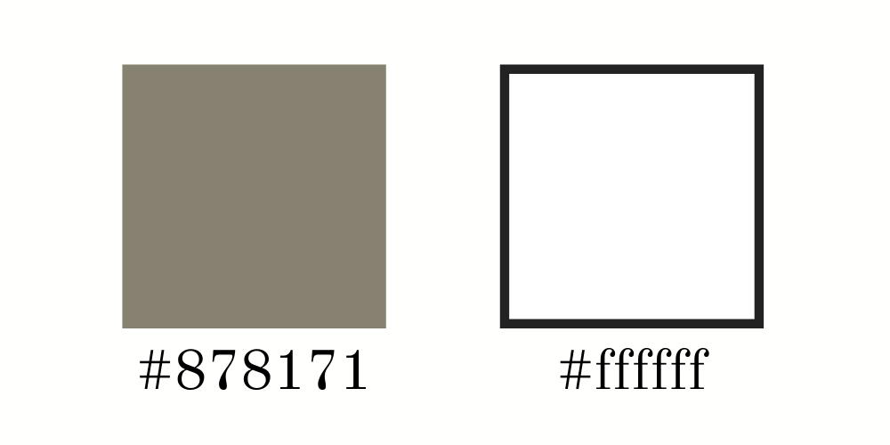
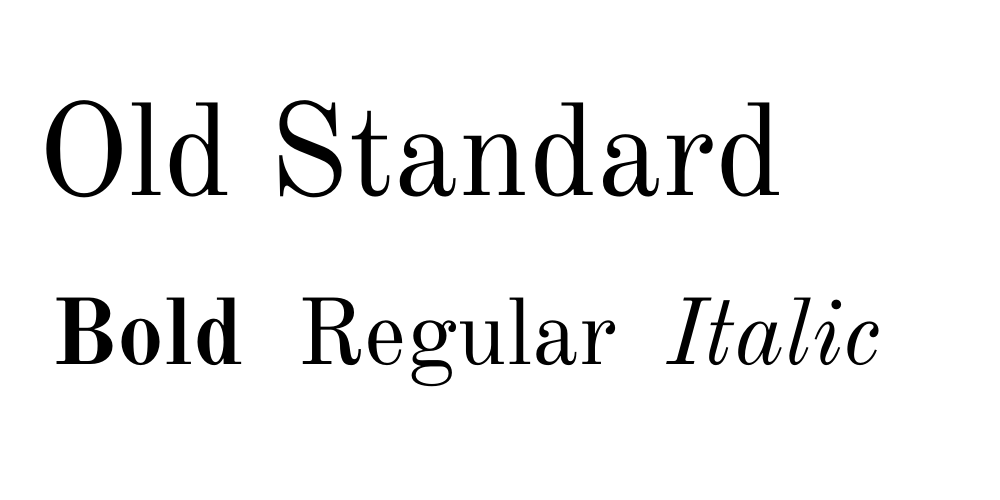

This blog takes a look at the typography used in everyday life and culture, bringing in ideas on how the stylistic choices used are so effective. From examining the packaging on our breakfast cereals to the writing we ink on our skin, this blog hopes to give a more personal insight into the typefaces we see everywhere, that make up our lives.

## The Banner Image

My banner image takes a focus on the texture of different surfaces, covering the full window screen to provide a large background to place the title. Highlighting the recognisable face of my media brand, and making the title the forefront of the website, this choice demonstrates a distinct branding often seen in lifestyle and culture magazines and leaves the design of the logo and title to speak for itself.

The brand has a very minimalist aesthetic. There are different surfaces are used as backgrounds throughout the site, each image is of a familiar texture that is recognisable to every individual. This draws on other business' branding of featuring large amounts of whitespace within their content, however brings something different to the table. An angle that subconsciously makes this brand feel more trusted. The title is written in all lowercase characters as a decision to make the lettering more soft to the viewer. The decision in colour palette and typeface reinforce this, building on classic simplicity. 

## The Logo

My Logo reiterates the design, forming a simplified version of the title that can be easily identified even at a small size on screen. Following suit in lowercase, the logo shows an elegant design with a small amount of whitespace and a basic typeface. This style is delicate and has a sense of clarity often associated with sophistication and harmony, this means the viewer is able to recognise the media brand easily from what they can see. The logo itself is the 't' key on a typewriter shown in a minimalist form, this nods at both the trends of culture magazines in the industry and also the key theme of this site - typography. 

## The Favicon

The favicon is a further simplified version showing "t" as a single character. This reflects the size restraints and ensures the text is still clear. It draws on features from favicons of the most successful brands in the industry, such as the use of one character but replaces the stark black lettering with a softer beige colour. 

## Inspirations

For the design of my logo I drew inspiration from the following media brands. 

## Colour

The colour palette was curated from industry titans using an only black and white theme however this is replaced with the use of a cool tone beige . These colours again incorporate a simplicity and clarity which have connotations of strength and trust, this reflects some of the brand values of trust, loyalty and honesty. There is a high contrast between the colours; this large amount of whitespace makes the website appear clean and tidy due to the high brightness. 

## Typeface

The website uses a serif typeface which increases the level of sophistication and creates a more classic and trusted feel. The typeface used is "Old Standard", which has a large x-height and a small area of space between the baseline and descender line, this makes it easy to read in text. Together with the light weight of the typeface the text feels more luxurious, yet using lowercase lettering connects the brand to the viewer, implying a soft and relatable side. 

